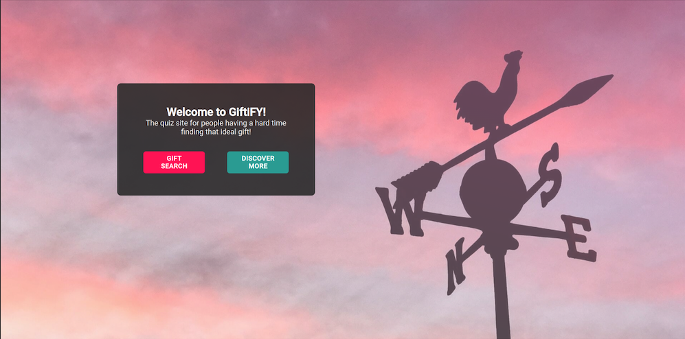
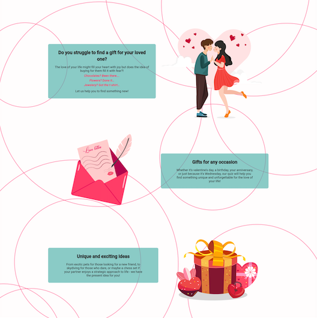
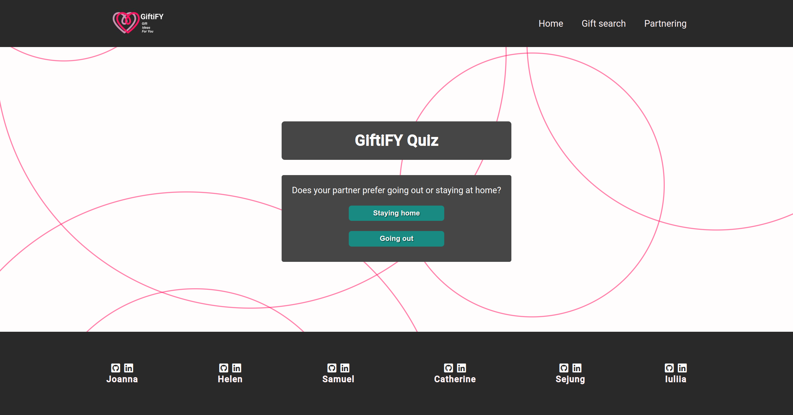
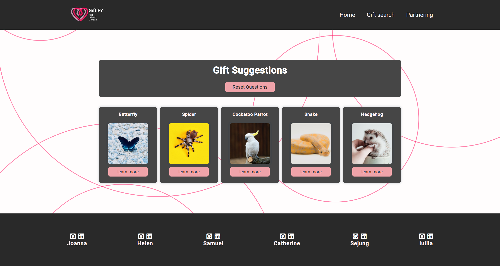
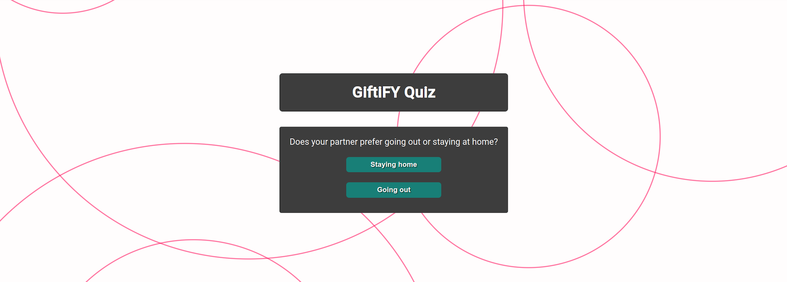
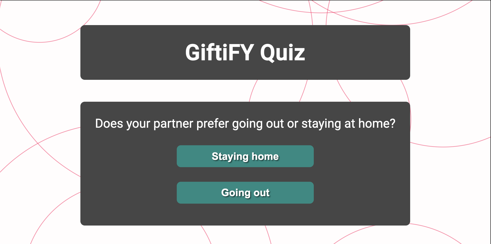
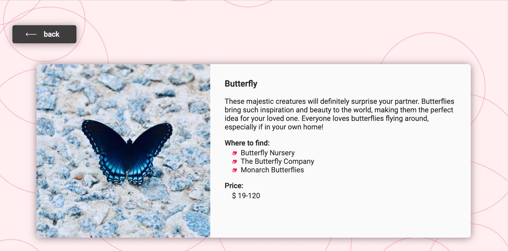
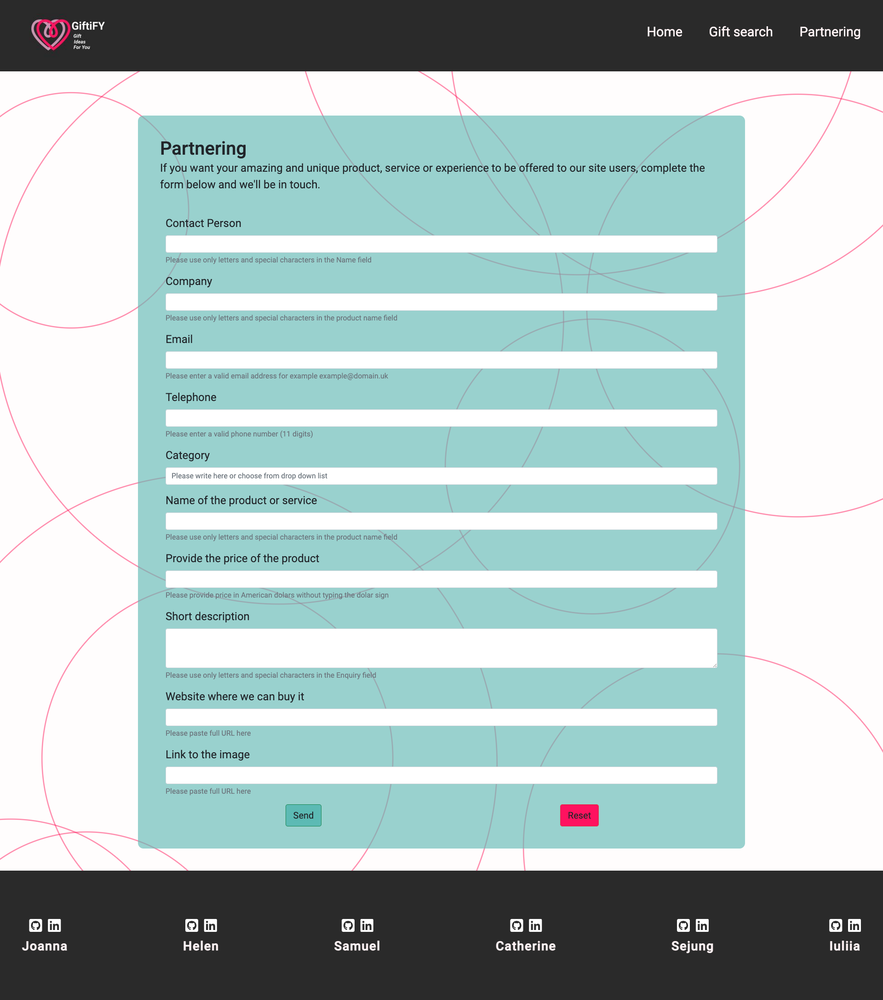

# GiftiFY

<a href="https://jogorska.github.io/hackathon-team-1/index.html" target="_blank">View the live site here</a>

# Contents

* [Project Overview](#project-overview)
* [User Experience Design](#user-experience-design)
   * [Strategy](#strategy)
   * [Scope](#scope)
   * [Structure](#structure)
   * [Skeleton](#skeleton)
   * [Surface](#surface)
* [Technologies Used](#technologies-used)
* [Testing](#testing)
* [Deployment](#deployment)
* [Credits](#credits)

<small><i><a href='http://ecotrust-canada.github.io/markdown-toc/'>Table of contents generated with markdown-toc</a></i></small>

# Project Overview

A site to provide ideas for alternative Valentine's day gifts. 

Site users are invited to answer questions about the personality traits and behaviour of the recipient...

# User Experience Design

## Strategy

### Target Audience

Who is the site for?

### User Stories:

#### User stories that were met by creating clear cards / modals with necesary information about each gift

- [#27](https://github.com/JoGorska/hackathon-team-1/issues/27) As a Returning Visitor, I want to see a price range on a gift, so I can evaluate my expenses.

- [#26](https://github.com/JoGorska/hackathon-team-1/issues/26) As a Returning Visitor, I want to find possible ways how to purchase a particular gift, so I can easily make a purchase.

- [#25](https://github.com/JoGorska/hackathon-team-1/issues/25) As a Returning Visitor, I want to see the benefits of choosing a particular gift, so I can be sure about my choice.

- [#24](https://github.com/JoGorska/hackathon-team-1/issues/25) As a Returning Visitor, I want to have different gift options to choose from, so I can make a final decision on a gift.

#### User stories met by quizz questions, that are aiming to ascertain the needs of the user and prefferences for the gift

- [#23](https://github.com/JoGorska/hackathon-team-1/issues/25) As a Returning Visitor, I want to be able to find a gift, which will be suitable for my partner or friend, so my partner/friend will be satisfied.

- [#22](https://github.com/JoGorska/hackathon-team-1/issues/25) As a Returning Visitor, I want to be able to get advice what to choose as a gift for my partner or friend on Valentine's day, so I can have a gift fitting their needs and preferences.

- [#21](https://github.com/JoGorska/hackathon-team-1/issues/25) As a First Time Visitor, I want to find the app useful, so I can use it according to my needs in finding a good gift for my partner.

#### User story met by adding nav bar:

- [#19](https://github.com/JoGorska/hackathon-team-1/issues/25) As a First Time Visitor, I want to be able to easily navigate through the app, so I can find the content.

#### User story met by 

- [#18](https://github.com/JoGorska/hackathon-team-1/issues/18) As a First Time Visitor, I want to easily understand the main purpose of the app, so I can learn more about this app.

#### User stories classed for next release:

- [#20](https://github.com/JoGorska/hackathon-team-1/issues/25) As a First Time Visitor, I want to be able to register my account, so I can learn the benefits of the app as a user.

### Categories of gifts

The final result of the search will be a category that the user has got to while following the quizz questions. Categories were created into issues and divided betwen team members:

- [#46](https://github.com/JoGorska/hackathon-team-1/issues/46) sightseeing

- [#45](https://github.com/JoGorska/hackathon-team-1/issues/45) Spa

- [#44](https://github.com/JoGorska/hackathon-team-1/issues/44) museum

- [#43](https://github.com/JoGorska/hackathon-team-1/issues/43) Wine testing

- [#42](https://github.com/JoGorska/hackathon-team-1/issues/42) restaurants

- [#41](https://github.com/JoGorska/hackathon-team-1/issues/41) picnics

- [#40](https://github.com/JoGorska/hackathon-team-1/issues/40) Couples cooking classes

- [#39](https://github.com/JoGorska/hackathon-team-1/issues/39) watching outdoor sport

- [#38](https://github.com/JoGorska/hackathon-team-1/issues/38) rides

- [#37](https://github.com/JoGorska/hackathon-team-1/issues/37) theme parks

- [#36](https://github.com/JoGorska/hackathon-team-1/issues/36) team sport

- [#35](https://github.com/JoGorska/hackathon-team-1/issues/35) Extreme travelling

- [#34](https://github.com/JoGorska/hackathon-team-1/issues/34) technologies

- [#33](https://github.com/JoGorska/hackathon-team-1/issues/33) Animals

- [#32](https://github.com/JoGorska/hackathon-team-1/issues/32) Games

- [#30](https://github.com/JoGorska/hackathon-team-1/issues/30) Homemade food

- [#29](https://github.com/JoGorska/hackathon-team-1/issues/29) plants, flowers, trees

- [#28](https://github.com/JoGorska/hackathon-team-1/issues/28) handcraft

## Scope

**Features**

The site contains 3 pages: Home, Gift search, Partnering. And the header and footer are identical on every page.

- The header
  - The fully responsive navigation bar includes links to the Home, Gift search and Partnering page and is identical in each page to allow for easy navigation.
  - The navigation menu collapses on small devices less than 768px width.

- The footer
  - The footer contains collaborators’ names and links to their GitHub and LinkedIn Pages which open in a new tab.

- Home Page

  - The home page includes an image of a signpost with text overlay to allow the user to see exactly what the site is about.
  - The “Gift search” button links to the Gift search page and the “Discover more” button links to the feature section of the home page.
  
  - The Feature section contains detailed descriptions about the site: who is the site for, how it works and what the user can expect.
  
  - The “Fill out the form” button links to the Partnering page.
  

- Gift Search Page

  - The gift search page features a fully responsive design.
  - This page includes guided questions, 18 categories, 5 gift ideas for each category and the detail page for each gift idea.
  - The page starts with a text “GiftiFY Quiz” and “Start” button.

  - Each page has a “Reset Questions” button which links to the first page of the Gift search page.

  - The guided questions has 2 options the user can choose and the next question renders depending on the user’s answer to the previous question.

  - When the user chooses a category, 5 gift ideas with the “Learn more” button render.

  - The detail page contains a “back” button which allows the user to choose different ideas, an item image and description with external links and price. The external links open in a new tab so that the user can stay on the site.

- Partnering Page

  - This page allows the user to submit their product or service for the “GiftiFY” team to review.
  - All fields are required and show error messages if not filled or invalid.
  - The “send” button submits the information the user supplied and the “reset” button removes their information in the form.

**Future features**

COMMERCIALLY WHERE COULD THIS APP GO? WHAT ARE THE FUTURE STEPS?

## Structure

SITE MAP

## Skeleton

[wireframes](documentation/wireframes.pdf)

## Surface

**Template**

The site uses the xxx template from xxx (including links).

**Typography**

The site uses xxx font.

**Color Scheme**

The site uses xxx color scheme.

**Imagery**

Copy of images used and source links.

- [skydive1.jpg](https://en.bodyflight.se/)
- [paintball1.jpeg](https://www.pexels.com/)
- [horseback1.jpg](https://unsplash.com/)
- [rafting.jpg](https://unsplash.com/)
- [bubbles1.jpg](--https://www.bubble-allstars.com/)
- [kayak1.jpg](https://www.pexels.com/)
- [zorb1.jpg](https://sv.wikipedia.org/wiki/Zorb)
- [skateboard1.jpg](https://unsplash.com/)
- [hangglider1.jpg](https://www.pexels.com/)
- [surf.jpg](https://www.pexels.com/)
- [sunglasses1.jpg](https://www.bose.com/en_us/products/frames.html)
- [vr.jpg](https://unsplash.com/)
- [couchmaster1.jpg](https://www.nerdytec.com/en/mixxxer.php?products_id=34)
- [glasses1.jpg](https://www.syghtglass.com/collections/gaming-glasses)
- [hat.jpg](https://www.walmart.com/)

# Technologies Used

The project uses the following languages;

* HTML5
* CSS
* JavaScript

The project was created on GitHub and uses the following libraries and frameworks:

* Balsamiq - used to create all wireframes
* Materialize - the site layout uses the Parallax template from Materialize, which has been heavily modified
* Google Fonts - Segoe UI, Roboto, Oxygen-Sans, Ubuntu, Cantarell, Helvetica Neue, sans-serif

# Testing

See separate Testing file for information on testing and issues.

# Deployment

**How to fork the GitHub Repository**

Forking the repository allows you to make a copy of the original in your GitHub account, and make changes without affecting the original.

1. Log onto Github.
2. From the list of repositories, select JoGorska/hackathon-team-1.
3. At the top of the repository, select the "Fork" button.
4. This should create a copy within your account.

**How to run this project locally**

1. Log onto Github: create an account if required.
2. From the list of repositories, select JoGorska/hackathon-team-1.
3. Click the "Code" dropdown within the menu above the commits.
4. Copy the URL address, or Download ZIP and save locally.
5. Open your chosen IDE and navigate to the location you want the cloned directory to be saved.
6. Type git clone and copy the URL within the CLI and press enter.
7. Alternatively, select "Open with Github Desktop".

# Credits

This site was created as part of Code Institute's February 2022 Hackathon...

Group members...

Info sources...
